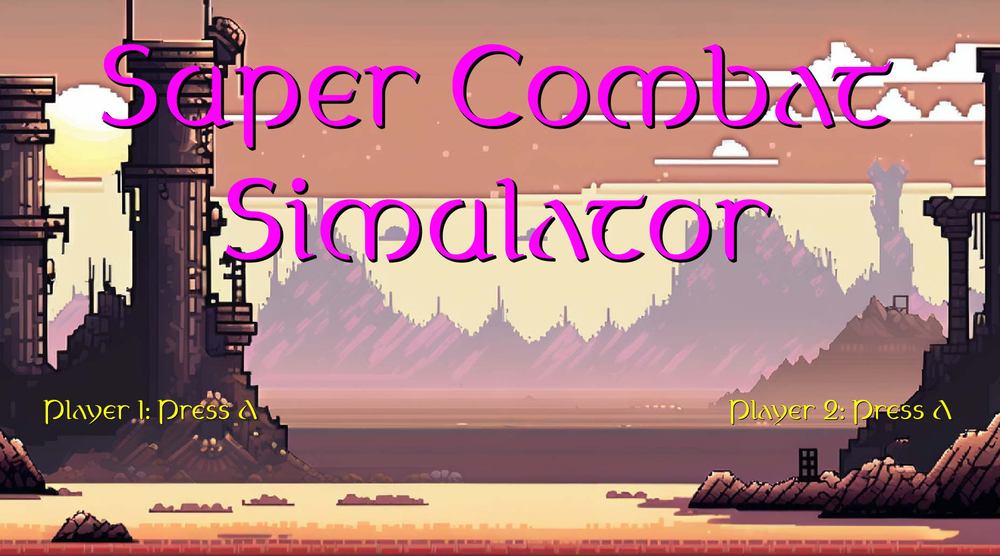

# Super Combat Simulator

A 2-player game for the 3m5. GameJam#10.

## Aim of the game
You fight your opponent on the other side of the screen by deploying new units.
Killing enemy units earns you money, which you can use to buy new units or upgrades.
The aim of the game is to destroy your opponent's base.

## Controls

Two controllers are required to play the game.
Units are created by pressing the displayed button in the time window.
The purchase menu can be opened and closed with RB.